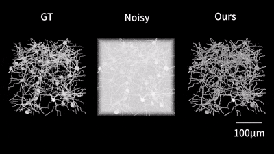

<p>
<h1 align="center">SelfMirror</h1>
<h5 align="center">Self-Supervised Denoising for Enhanced Volumetric Reconstruction and Signal
   Interpretation in Two-photon Microscopy.</h5>
</p>

<div align="center">

[**Introduction**](#-Introduction) **|**[**Installation**](#-Installation) **|** [**Dataset**](#-Dataset) **|**[**Training**](#-Training) **|**[**Inference**](#-Inference) **|**[**Models**](#-Models)

</div>

---

## -Introduction 

<p>

</p>
<!-- <br> -->

Volumetric imaging is increasingly in demand for its precision in statistically
visualizing and analyzing the intricacies of biological phenomena. To visualize the intricate
details of these minute structures and facilitate the analysis in biomedical research, high signal-to-noise
ratio (SNR) images are indispensable. However, the inevitable noise presents a significant
barrier to imaging qualities. Here, we propose SelfMirror, a self-supervised deep-learning
denoising method for volumetric image reconstruction. SelfMirror is developed based on the
insight that the variation of biological structure is continuous and smooth, when the sampling
interval in volumetric imaging is sufficiently small, the similarity of neighboring slices in terms
of the spatial structure becomes apparent. Such similarity can be used to train our proposed
network to revive the signals and suppress the noise accurately. The denoising performance of
SelfMirror exhibits remarkable robustness and fidelity even in extremely low SNR conditions.

<br>

##  Installation

### Tested platform
  - Python = 3.12.8, Pytorch = 2.5.1 (`Win 11`, `64 GB RAM`, `NVIDIA RTX 3090 24 GB`, `CUDA 12.4`)

### Dependencies 
  - Python >= 3.8
  - PyTorch >= 2.0
    
### Instruction

1. Create a virtual environment and install PyTorch and other dependencies. Please select the correct Pytorch version that matches your CUDA version from [https://pytorch.org/get-started/previous-versions/](https://pytorch.org/get-started/previous-versions/).

 ```bash
 > conda create -n selfmirror python=3.12
 > conda activate selfmirror
 > pip install torch == 2.5.1
 ```
2. Install other dependencies.
 ```bash
 > pip install matplotlib scikit-learn scikit-image tifffile
 ```
3. Clone the repository.
 ```bash
 > git clone https://github.com/utixx/SelfMirror.git
 > cd SelfMirror
 ```

## Dataset

Download the demo data provided in [here](https://github.com/utixx/SelfMirror/releases/tag/data).


## Training 

set your data path and put your data into  ```./datasets/data_name/data_name.tif``` 

Run the new_train.py to start training.
   ```bash
    > python new_train.py
  ```
The parameter can be changed as required in **new_train.py.**

```datasets_store_dir```: datasets path containing all the datasets.

```dataset_name```: dataset folder name containing the specific dataset.

```epoch_num```: epoch number for training.

see code comments for all the details

##  Inference
set your data path and put your data into  ```./datasets/dataset_name/dataset_name.tif``` 

Run the new_train.py to start training.
   ```bash
    > python new_test.py
  ```
The parameter can be changed as required in **new_test.py.**

```datasets_store_dir```: datasets path containing all the datasets.

```dataset_name```: dataset folder name containing the specific dataset.

```denoise_models```: the folder containing all the pre-trained models.

see code comments for all the details

##  Models

We have provided 7 generalized pre-trained models for specific tasks and stored them in the ```SelfMirror/pth``` path.  

| No. | Data                                            | Microscopy system | 
|:---:|-------------------------------------------------|:-----------------:| 
|  1  | Simulated data of TPM with added P4 noise       |       NAOMi       |  
|  2  | Simulated data of TPM with added P16 noise      |       NAOMi       |  
|  3  | Neuron populations express EGFP                 |        TPM        | 
|  4  | Two-photon volumetric imaging of dendrites      |        TPM        |  
|  5  | Volumetric structural imaging of Penicillium.   |     Confocal      | 
|  6  | thoracoabdominal computed tomography of humans. |        CT         |
|  7  | Neuron 3D electron microscopy of mouse cortex.  |       3D-EM       |


